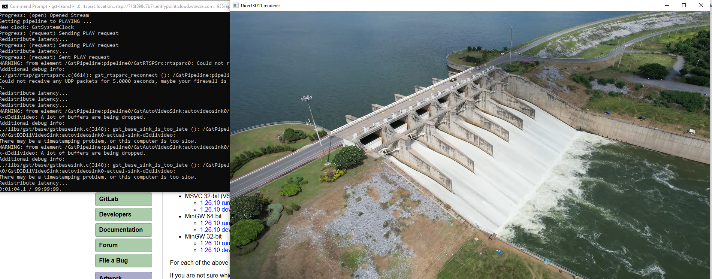
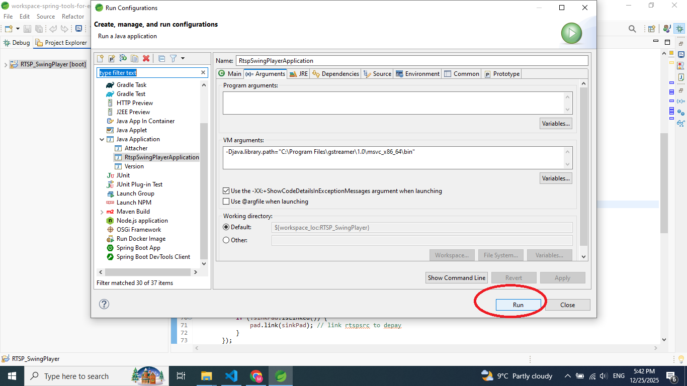
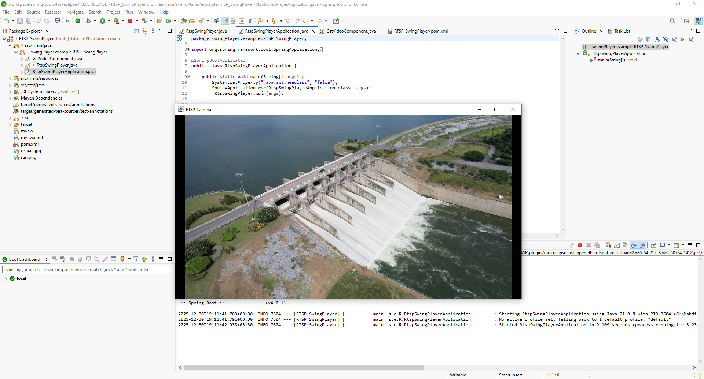

# RTSP_Camera_player_java_Gstreamer
This app is a RTSP camera player using java and Gsteamer. For running this app you need to install Gsteamer on your machine first.


# How to use
## Install Gstreamer

You can download Gstreamer for machine with this link:
https://gstreamer.freedesktop.org/download/#windows

## Check installation
Check whether Gstreamer is installed on your machine with this command:
 ```
 gst-launch-1.0 --version
 ```

## Test Gstreamer
If gst is installed properly test it with this command no need to video for this command:
 ```
 gst-launch-1.0 videotestsrc ! autovideosink   
 ```
You should see a black window.

## Test a RTSP link in Gstreamer
You can see a RTSP sream in with Gstreamer using this command:
a sample link:"rtsp://716f898c7b71.entrypoint.cloud.wowza.com:1935/app-8F9K44lJ/304679fe_stream2"

 ```
 gst-launch-1.0 rtspsrc location=rtsp://716f898c7b71.entrypoint.cloud.wowza.com:1935/app-8F9K44lJ/304679fe_stream2 latency=200 ! decodebin ! autovideosink
 ```
You will see a water dam in in stream.



# How to run the project
## prerequirment:
- JDK 21
- gstreamer core 
## Install maven
Install maven and run project I normal if app doen't work.

## Set JVM option
Now you should set JVM option , I developed this project with spring tool suite (STS). In STS you should set JVM arument like this:

 ```
 Right click on project > Run as > Run configurations > Java Apllication > Click on RtspSwingPlayerApplication > Click on Arguments tab 
 > Set VM arguments like this : -Djava.library.path="[your path]\gstreamer\1.0\msvc_x86_64\bin"
 > Click apply > click Run
 ```



Now app should show you water dam in in stream.




good luck!

Author: Mahdieh Eftekharian
